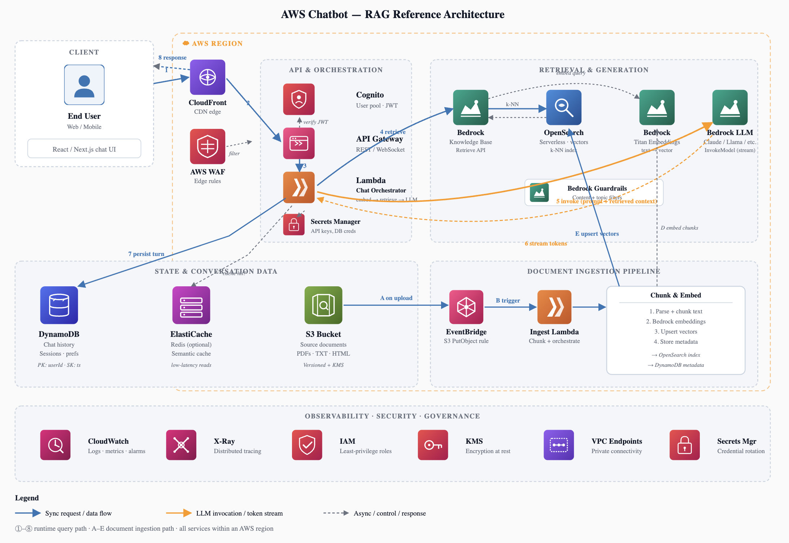

# tech-diagrams

A skill for generating polished, customizable tech diagrams from plain-English prompts.

## Features

- **Multiple Diagram Types**: Cloud architecture, sequence diagrams, ER diagrams, swimlane flowcharts, and more
- **Interactive Output**: HTML artifacts with live theme switching and SVG download
- **Customizable Themes**: Corporate, Clean/Minimal, Blueprint, Colorful, and Gold/Amber themes
- **Flexible Node Styles**: Plain boxes or illustrated nodes with SVG icons
- **Smart Prompt Analysis**: Automatically asks clarifying questions when needed

## Supported Diagram Types

- **Cloud Architecture Diagram** — cloud services, microservices, distributed systems
- **Sequence Diagram** — time-ordered interactions between actors/services
- **Entity Relationship Diagram** — database schemas, entity connections
- **Swimlane Flowchart** — process flows with parallel lanes (actors/teams)
- **Left-to-Right Flowchart** — linear process or data pipeline
- **Top-Down Flowchart** — hierarchical or step-by-step flows
- **Network/Cloud Topology** — physical/cloud infrastructure layout
- **Data Flow Diagram** — data movement and transformation

## Themes

| Theme | Description |
|---|---|
| **Corporate** (default) | Professional blue/grey color scheme |
| **Clean/Minimal** | Minimalist white/grey design |
| **Blueprint** | Dark theme with blue accents |
| **Colorful** | Vibrant purple/green palette |
| **Gold/Amber** | Dark background with gold accents |

## Installation

To use this skill with Claude:

1. Open **Claude** → **Settings** → **Customize Claude** → **Create New Skill**
2. Select **Upload Zip File**
3. Zip this repository and upload it
4. Start asking Claude to generate diagrams with /tech-diagram

## Usage Examples

### Basic Architecture Diagram
```
Create a microservices architecture diagram for a RAG chatbot system with User Interface, API Gateway, Retrieval Service, LLM Service, and Vector Database.
```

### Complete Template Example
Here's a full example prompt that covers all key aspects for maximum detail:

**User Prompt:** "Create a swimlane flowchart for a RAG chatbot system. The main components are: User, Chatbot Interface, Retrieval Service, Vector Database, and LLM Service. The flow goes left-to-right: User sends query → Chatbot Interface → Retrieval Service searches Vector Database → Retrieves relevant documents → Passes to LLM Service → Generates response → Returns to User. Use 4 swim lanes (one for each service plus User). Output as an interactive HTML artifact with theme controls. Choose the Corporate theme. Use icon nodes for each component (e.g., user icon for User, chat icon for Chatbot Interface, search icon for Retrieval Service, database icon for Vector Database, brain icon for LLM Service)."

This prompt specifies:
- **System components / actors:** User, Chatbot Interface, Retrieval Service, Vector Database, LLM Service
- **Data or control flow direction:** Left-to-right flow with specific steps
- **Layout preference:** Swimlane flowchart
- **Output preference:** Interactive HTML artifact with theme controls
- **Theme preference:** Corporate
- **Number of lanes/stages:** 4 swim lanes
- **Node style:** Icon nodes with specific icons

### Flowchart with Swimlanes
```
Show me a swimlane diagram for our order fulfillment process involving Customer, Warehouse, and Shipping teams.
```

### Network Topology
```
Generate a cloud network topology showing our AWS VPC with public and private subnets, NAT gateway, and internet gateway.
```

### AWS Chatbot RAG Architecture
See [aws-chatbot-rag-architecture.html](aws-chatbot-rag-architecture.html) for a complete interactive example of an AWS-based RAG chatbot architecture diagram with theme switching and SVG download.




## Node Styles

Choose between:
- **Plain boxes** — Clean rectangular nodes with text labels (fast, editable)
- **Icon nodes** — Visual nodes with hand-drawn SVG icons (database, cloud, gear, etc.)

## Development

This repository contains:
- `SKILL.md` — Claude skill definition and pipeline
- `references/` — HTML templates, layout guides, and theme definitions
- `LICENSE` — MIT license

### References
- [HTML Template](references/html-template.html) — Interactive diagram shell
- [Layouts](references/layouts.html) — SVG coordinate templates for each diagram type
- [Themes](references/themes.html) — CSS variable definitions and previews

## License

MIT License - see [LICENSE](LICENSE) for details